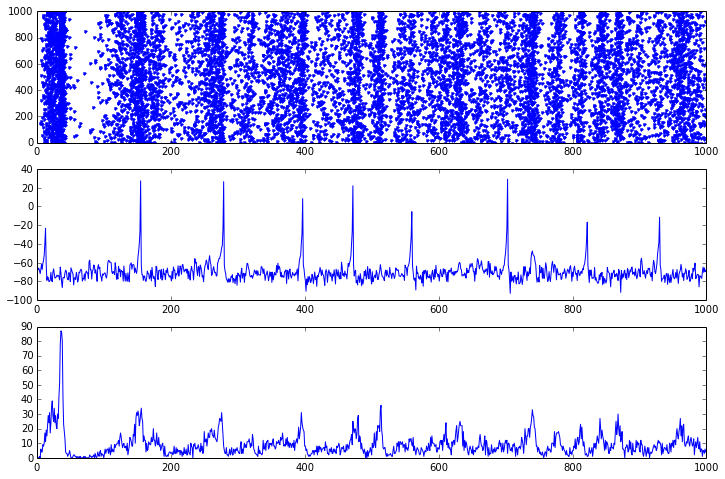

**************************************
Izhikevich's pulse-coupled network
**************************************

This script reproduces the simple pulse-coupled network proposed by
Eugene Izhikevich in the article:

**Izhikevich, E.M.** (2003). Simple Model of Spiking Neurons, *IEEE
Transaction on Neural Networks, 14:6*.

The original Matlab code is provided below:

.. code:: matlab

    % Created by Eugene M. Izhikevich, February 25, 2003
    % Excitatory neurons Inhibitory neurons
    Ne = 800; Ni = 200;
    re = rand(Ne,1); ri = rand(Ni,1);
    a = [0.02*ones(Ne,1); 0.02+0.08*ri];
    b = [0.2*ones(Ne,1); 0.25-0.05*ri];
    c = [-65+15*re.^2; -65*ones(Ni,1)];
    d = [8-6*re.^2; 2*ones(Ni,1)];
    S = [0.5*rand(Ne+Ni,Ne), -rand(Ne+Ni,Ni)];
    v = -65*ones(Ne+Ni,1); % Initial values of v
    u = b.*v; % Initial values of u
    firings = []; % spike timings
    for t=1:1000 % simulation of 1000 ms
        I = [5*randn(Ne,1);2*randn(Ni,1)]; % thalamic input
        fired = find(v>=30); % indices of spikes
        firings = [firings; t+0*fired,fired];
        v(fired) = c(fired);
        u(fired) = u(fired) + d(fired);
        I = I + sum(S(:,fired),2);
        v = v + 0.5*(0.04*v.^2 + 5*v + 140 - u + I); % step 0.5 ms
        v = v + 0.5*(0.04*v.^2 + 5*v + 140-u + I); % for numerical
        u = u + a.*(b.*v - u); % stability
    end;
    plot(firings(:,1),firings(:,2),’.’)

Neuron type
-----------

The network is composed of parameterized quadratic integrate-and-fire
neurons, known as *Izhikevich* neurons. They are simply defined by the
following equations:

::

        dv/dt = 0.04 * v^2 + 5 * v + 140.0 - u + I 
        du/dt = a * (b*v - u)

        if v > 30.0:
            emit_spike()
            v = c
            u = u + d

where ``v`` is the membrane potential, ``u`` is the membrane recovery
variable and ``a``, ``b``, ``c``, ``d`` are parameters allowing to
reproduce many types of neural firing.

``I`` is the input voltage to a neuron at each time ``t``. For the
desired network, it is the sum of a random value taken from a normal
distribution with mean 0.0 and variance 1.0 (multiplied by a scaling
factor) and the net effect of incoming spikes (excitatory and
inhibitory).

Implementing such a neuron in ANNarchy is straightforward:

.. code:: python

    Izhikevich = Neuron(
        parameters="""
            noise = 5.0 : population
            a = 0.02
            b = 0.2
            c = -65.0
            d = 2.0 
            v_thresh = 30.0
        """,
        equations="""
            I = g_exc - g_inh + noise * Normal(0.0, 1.0)
            dv/dt = 0.04 * v^2 + 5.0 * v + 140.0 - u + I 
            du/dt = a * (b*v - u) 
        """,
        spike = """
            v >= v_thresh
        """,
        reset = """
            v = c
            u += d
        """
    )

The parameters ``a``, ``b``, ``c``, ``d`` as well as the noise amplitude
``noise`` are declared in the ``parameters`` argument, as their value is
constant during the simulation. ``noise`` is declared as the same
throughout the population with the ``population`` flag.

The equations for ``v`` and ``u`` are direct translations of their
mathematical counterparts. Note the use of ``dx/dt`` for the time
derivative and ``^2`` for the square function.

The input voltage ``I`` is defined as the sum of:

-  the total conductance of excitatory synapses ``g_exc``,
-  the total conductance of inhibitory synapses ``-g_inh`` (in this
   example, we consider all weights to be positive, so we need to invert
   ``g_inh`` in order to model inhibitory synapses),
-  a random number taken from the normal distribution :math:`N(0,1)` and
   multiplied by the noise scale ``noise``.

In the pulse-coupled network, synapses are considered as instantaneous,
i.e. a pre-synaptic spikes increases immediately the post-synaptic
conductance proportionally to the weight of the synapse, but does not
leave further trace. As this is the default behavior in ANNarchy,
nothing has to be specified in the neuron's equations.

The ``spike`` argument specifies the condition for when a spike should
be emitted (here the membrane potential ``v`` should be greater than
``v_thresh``). The ``reset`` argument specifies the changes to neural
variables that should occur after a spike is emitted: here, the membrane
potential is reset to the resting potential ``c`` and the membrane
recovery variable ``u`` is increased from ``d``.

The ``Izhikevich`` neuron is already defined in ANNarchy, so we will use
it directly.

Defining the populations
------------------------

We start by defining a population of 1000 Izhikevich neurons and split
it into 800 excitatory neurons and 200 inhibitory ones:

.. code:: python

    from ANNarchy import *
    
    pop = Population(geometry=1000, neuron=Izhikevich)
    Exc = pop[:800]
    Inh = pop[800:]

``Exc`` and ``Inh`` are subsets of ``pop``, which have the same
properties as a population. We can then set parameters differently for
each population:

.. code:: python

    re = np.random.random(800)      ; ri = np.random.random(200)
    Exc.noise = 5.0                 ; Inh.noise = 2.0
    Exc.a = 0.02                    ; Inh.a = 0.02 + 0.08 * ri
    Exc.b = 0.2                     ; Inh.b = 0.25 - 0.05 * ri
    Exc.c = -65.0 + 15.0 * re**2    ; Inh.c = -65.0
    Exc.d = 8.0 - 6.0 * re**2       ; Inh.d = 2.0
    Exc.v = -65.0                   ; Inh.v = -65.0
    Exc.u = Exc.v * Exc.b           ; Inh.u = Inh.v * Inh.b
    
Defining the projections
------------------------

We can now define the connections within the network: 

1. The excitatory neurons are connected to all neurons with a weight randomly chosen in [0, 0.5] 
2. The inhibitory neurons are connected to all neurons with a weight randomly chosen in [0, 1]

.. code:: python

    exc_proj = Projection(pre=Exc, post=pop, target='exc')
    exc_proj.connect_all_to_all(weights=Uniform(0.0, 0.5))
       
    inh_proj = Projection(pre=Inh, post=pop, target='inh')
    inh_proj.connect_all_to_all(weights=Uniform(0.0, 1.0))

The network is now ready, we can compile:

.. code:: python

    compile()
    
Running the simulation
----------------------

We start by monitoring the spikes and membrane potential in the whole
population:

.. code:: python

    M = Monitor(pop, ['spike', 'v'])
    
We run the simulation for 1000 milliseconds:

.. code:: python

    simulate(1000.0, measure_time=True)

We retrieve the recordings, generate a raster plot and the population
firing rate:

.. code:: python

    spikes = M.get('spike')
    v = M.get('v')
    t, n = M.raster_plot(spikes)
    fr = M.histogram(spikes)
    
We plot: 

1. The raster plot of population 
2. The evolution of the membrane potential of a single excitatory neuron 
3. The population firing rate

.. code:: python

    # First plot: raster plot
    ax = plt.subplot(3,1,1)
    ax.plot(t, n, 'b.')
    # Second plot: membrane potential of a single excitatory cell
    ax = plt.subplot(3,1,2)
    ax.plot(v[:, 15]) # for example
    # Third plot: number of spikes per step in the population.
    ax = plt.subplot(3,1,3)
    ax.plot(fr)
    plt.show()

    
