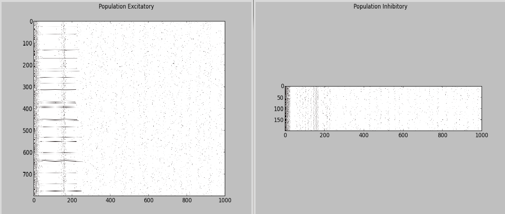

***********************************
Izhikevich's pulse-coupled network
***********************************

The script ``Izhikevich.py`` in ``examples/izhikevich`` reproduces the simple pulse-coupled network proposed by Eugene Izhikevich in the article:

    **Izhikevich, E.M.** (2003). Simple Model of Spiking Neurons, *IEEE Transaction on Neural Networks, 14:6*.
    

    
Description of the network
==========================

The proposed network is composed of two populations of spiking neurons: one population of 800 excitatory neurons and another of 200 inhibitory neurons, all identical except for some parameters. The network is fully connected with random weights.

The article provides the matlab code for the simulation:

.. code-block:: matlab

    % Created by Eugene M. Izhikevich, February 25, 2003
    % Excitatory neurons Inhibitory neurons
    Ne = 800; Ni = 200;
    re = rand(Ne,1); ri = rand(Ni,1);
    a = [0.02*ones(Ne,1); 0.02+0.08*ri];
    b = [0.2*ones(Ne,1); 0.25-0.05*ri];
    c = [-65+15*re.^2; -65*ones(Ni,1)];
    d = [8-6*re.^2; 2*ones(Ni,1)];
    S = [0.5*rand(Ne+Ni,Ne), -rand(Ne+Ni,Ni)];
    v = -65*ones(Ne+Ni,1); % Initial values of v
    u = b.*v; % Initial values of u
    firings = []; % spike timings
    for t=1:1000 % simulation of 1000 ms
        I = [5*randn(Ne,1);2*randn(Ni,1)]; % thalamic input
        fired = find(v>=30); % indices of spikes
        firings = [firings; t+0*fired,fired];
        v(fired) = c(fired);
        u(fired) = u(fired) + d(fired);
        I = I + sum(S(:,fired),2);
        v = v + 0.5*(0.04*v.^2 + 5*v + 140 - u + I); % step 0.5 ms
        v = v + 0.5*(0.04*v.^2 + 5*v + 140-u + I); % for numerical
        u = u + a.*(b.*v - u); % stability
    end;
    plot(firings(:,1),firings(:,2),’.’)

Defining the neuron type
========================

The network is composed of parameterized quadratic integrate-and-fire neurons, known as *Izhikevich* neurons. They are simply defined by the following equations::

    dv/dt = 0.04 * v^2 + 5 * v + 140.0 - u + I 
    du/dt = a * (b*v - u)

    if v > 30.0:
        emit_spike()
        v = c
        u = u + d

where ``v`` is the membrane potential, ``u`` is the membrane recovery variable and ``a``, ``b``, ``c``, ``d`` are parameters allowing to repreduce many types of neural firing.

``I`` is the input voltage to a neuron at each time ``t``. For the desired network, it is the sum of a random value taken from a normal distribution with mean 0.0 and variance 1.0 (multiplied by a scaling factor) and the net effect of incoming spikes (excitatory and inhibitory).

Implementing such a neuron in ANNarchy is straightforward::

    Izhikevich = Neuron(
        parameters="""
            noise = 5.0 : population
            a = 0.02
            b = 0.2
            c = -65.0
            d = 2.0 
            v_thresh = 30.0
        """,
        equations="""
            I = g_exc - g_inh + noise * Normal(0.0, 1.0)
            dv/dt = 0.04 * v^2 + 5.0 * v + 140.0 - u + I 
            du/dt = a * (b*v - u) 
        """,
        spike = """
            v >= v_thresh
        """,
        reset = """
            v = c
            u += d
        """
    )

The parameters ``a``, ``b``, ``c``, ``d`` as well as the noise amplitude ``noise`` are declared in the ``parameters`` argument, as their value is constant during the simulation. ``noise`` is declared as the same throughout the population with the ``population`` flag.

The equations for ``v`` and ``u`` are direct translations of their mathematical counterparts. Note the use of ``dx/dt`` for the time derivative and ``^2`` for the square function.

The input voltage ``I`` is defined as the sum of: 

* the total conductance of excitatory synapses ``g_exc``,
* the total conductance of inhibitory synapses ``-g_inh`` (in this example, we consider all weights to be positive, so we need to invert ``g_inh`` in order to model inhibitory synapses),
* a random number taken from the normal distribution :math:`N(0,1)` and multiplied by the noise scale ``noise``.
  
In the pulse-coupled network, synapses are considered as instantaneous, i.e. a pre-synaptic spikes increases immediately the post-synaptic conductance proportionally to the weight of the synapse, but does not leave further trace. As this is the default behavior in ANNarchy, nothing has to be specified in the neuron's equations (see :doc:`../manual/SpikeNeuron`).

The ``spike`` argument specifies the condition for when a spike should be emitted (here the membrane potential ``v`` should be greater than ``v_thresh``). The ``reset`` argument specifies the changes to neural variables that should occur after a spike is emitted: here, the membrane potential is reset to the resting potential ``c`` and the membrane recovery variable ``u`` is increased from ``d``.

.. note::

    This neuron is already implemented in ANNarchy, so the script does not need to declare this neuron type.

Creating the populations
========================

We can now create two populations ``Exc`` and ``Inh`` representing the excitatory and inhibitory neurons. Note that we could have created a unique population containing all neurons, as they are of the same type, but splitting them into two populations will ease the definition of the projections.

.. code-block:: python

    # Create the excitatory population
    Exc = Population(name='Exc', geometry=800, neuron=Izhikevich)
    re = np.random.random(800)
    Exc.noise = 5.0
    Exc.a = 0.02
    Exc.b = 0.2
    Exc.c = -65.0 + 15.0 * re**2
    Exc.d = 8.0 - 6.0 * re**2
    Exc.v = -65.0
    Exc.u = Exc.v * Exc.b

    # Create the Inh population
    Inh = Population(name='Inh', geometry=200, neuron=Izhikevich)
    ri = np.random.random(200)
    Inh.noise = 2.0
    Inh.a = 0.02 + 0.08*ri
    Inh.b = 0.25 - 0.05*ri
    Inh.c = -65.0
    Inh.d = 2.0 
    Inh.v = -65.0
    Inh.u = Inh.v * Inh.b
    
After creating the two populations, we have to initialize the parameters and variables to the adequate values. Note that only parameters/variables whose value is different from the one defined in the neuron type need to be specified. Here, we systematically reinitialized all parameters/variables, but it is a waste of time. 

The values of the the parameters depend on random variables ``re`` and ``ri`` which are unique for each neuron of each population. Note that any operation is possible when initializing a variable (for example ``u = b*v``), as long as a Numpy array of the same size/geometry as the population is provided.

Connecting the populations
==========================

Excitatory neurons project to all neurons in the network with a weight randomly initialized in [0, 0.5]. Inhibitory neurons also project to all neurons, with a weight initialized in [0, 1]. As we have 2 populations, we need to define four all-to-all projections:

.. code-block:: python

    exc_exc = Projection(
        pre=Exc, 
        post=Exc, 
        target='exc'
    ).connect_all_to_all(weights=Uniform(0.0, 0.5))
       
    exc_inh = Projection(
        pre=Exc, 
        post=Inh, 
        target='exc',
    ).connect_all_to_all(weights=Uniform(0.0, 0.5))
      
    inh_exc = Projection(
        pre=Inh, 
        post=Exc, 
        target='inh'
    ).connect_all_to_all(weights=Uniform(0.0, 1.0))
      
    inh_inh = Projection(
        pre=Inh, 
        post=Inh, 
        target='inh'
    ).connect_all_to_all(weights=Uniform(0.0, 1.0))

The netword uses standard non-plastic synapses, so no ``Synapse`` type needs to be provided. We specify the ``exc`` or ``inh`` targets when creating the projections, so that ``g_exc`` and ``g_inh`` in the post-synaptic neurons are increased proportionally to the weight after each pre-synaptic spike.

Running the simulation
======================

Now that the populations and projections are created, we can compile the network::

    compile()

and run the simulation for 1 second. For analysis purpose, we need to record the spiking activity in both populations, as well as the evolution of the membrane potential in the excitatory population::

    Exc.start_record(['spike', 'v'])
    Inh.start_record('spike')

The simulation is executed by calling::

    simulate(1000.0, measure_time=True)

The duration is in milliseconds. ``measure_time`` allows to print the time needed to perform the simulation.

The analysis is performed using utility functions of ANNarchy (see :doc:`../API/Utilities`) and plotted using Matplotlib.

The recordings are first retrieved::

    exc_data = Exc.get_record()
    inh_data = Inh.get_record()

Raster plots are generated for each population using the ``raster_plot()`` utility function and concatenated::

    spikes_exc = raster_plot(exc_data['spike'])
    spikes_inh = raster_plot(inh_data['spike'])
    spikes = np.concatenate((spikes_exc, spikes_inh + [0, 800]), axis=0)

The number of spikes per simulation step in the excitatory population is compued using the ``histogram()`` functions::

    fr_exc = histogram(exc_data['spike'])

Finally, the raster plots for both populations, the evolution of the membrane potential of a single excitatory neuron and the evolution of the number of spikes in the excitatory poplation are plotted using Matplotlib::

    import pylab as plt
    # First plot: raster plot
    ax = plt.subplot(3,1,1)
    ax.plot(spikes[:, 0], spikes[:, 1], '.', markersize=1.0)
    # Second plot: membrane potential of a single excitatory cell
    ax = plt.subplot(3,1,2)
    ax.plot(exc_data['v']['data'][15, :]) # for example
    # Third plot: number of spikes per step in the population.
    ax = plt.subplot(3,1,3)
    ax.plot(fr_exc)
    plt.show()
