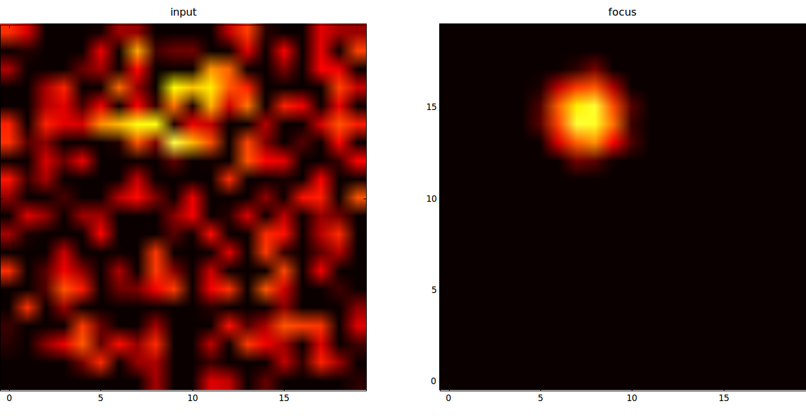

**************************
Neural Fields
**************************

The folder ``examples/neural_field`` contains a simple rate-coded model using `Neural Fields <http://www.scholarpedia.org/article/Neural_fields>`_. It consists of two 2D populations ``Input`` and ``Focus``, with one-to-one connections between ``Input`` and ``Focus``, and Difference-of-Gaussians (DoG) lateral connections within ``Focus``.

If you have PyQtGraph installed, you can simply try the network by typing::

    python NeuralField.py
    
    

    
Model overview
--------------------
    
Each population consists of N*N neurons, with N=20. The ``Input`` population is solely used to represent inputs for ``Focus``. The firing rate of each neuron is defined by a simple equation:

.. math::
    
    \text{input}_i(t) = (\text{baseline}_i(t) + \eta(t))^+
    
where :math:`\text{input}_i(t)` is the instantaneous firing rate, :math:`\text{baseline}_i(t)` its baseline activity, :math:`\eta(t)` an additive noise uniformly taken in :math:`[-0.5, 0.5]` and :math:`()^+` the positive function. 

The ``Focus`` population implements a discretized neural field, with neurons following the ODE:

.. math::

    \tau \frac{d \text{mp}_i(t)}{dt} + \text{mp}_i(t) = \text{input}_i(t) + \sum_{j=1}^{N} w_{i, j} \cdot \text{focus}_j(t) + \eta(t)
    
    \text{focus}_i(t) = f(\text{mp}_i(t))
    
where :math:`\text{focus}_i(t)` is the neuron's firing rate, :math:`\text{mp}_i(t)` its membrane potential, :math:`\tau` a time constant and :math:`w_{i, j}` the weight value (synaptic efficiency) of the synapse between the neurons j and i. :math:`f()` is a semi-linear function, ensuring the firing rate is bounded between 0 and 1.

Each neuron in ``Focus`` takes inputs from the neuron of ``Input`` which has the same index (or rank), leading to a ``one_to_one`` connection pattern.

The lateral connections within ``Focus`` follow a difference-of-Gaussians (``dog``) connection pattern, with the connection weights :math:`w_{i,j}` depending on the normalized euclidian distance between the neurons in the N*N population:

.. math:: 

    w_{i, j} = A^+ \cdot \exp(-\frac{1}{2}\frac{d(i, j)^2}{\sigma_+^2}) -  A^- \cdot \exp(-\frac{1}{2}\frac{d(i, j)^2}{\sigma_-^2})

If i and j have coordinates :math:`(x_i, y_i)` and :math:`(x_j, y_j)` in the N*N space, the distance between them is computed as:

.. math::

    d(i, j)^2 = (\frac{x_i - x_j}{N})^2 + (\frac{y_i - y_j}{N})^2
    
Inputs are given to the network by changing the baseline of ``input`` neurons. This example clamps one or several gaussian profiles (called "bubbles") with an additive noise, moving along a circular path at a certain speed (launch the example to understand this sentence...).

Importing ANNarchy
-------------------

The beginning of the script solely consists of importing the ANNarchy library:

.. code-block:: python

    from ANNarchy import *

Defining the neurons
--------------------------

There are two different equations for the neurons, so we need to define two ``RateNeuron`` objects: ``InputNeuron`` and ``NeuralFieldNeuron`` (for example). 

**InputNeuron**

``InputNeuron`` is straightforward, as ``baseline`` is an external input and the equation for the firing rate is regular:

.. code-block:: python

    InputNeuron = RateNeuron(   
        parameters="""
            baseline = 0.0
        """,
        equations="""
            noise = Uniform(-0.5, 0.5)
            r = pos(baseline + noise)
        """ 
    )
    
``InputNeuron`` is here an instance of ``RateNeuron``, whose only parameter is ``baseline`` (initialized to 0.0, but it does not matter here). ``noise`` is a random number generator, taken from a uniform distribution between -0.5 and 0.5, whose value is randomly chosen at each computational step for each neuron. ``r``, the only required variable, is simply the positive part of the sum of ``baseline`` and ``noise``. ``pos()`` is a built-in function of ANNarchy returning the positive part of its argument.

**NeuralFieldNeuron**

The second neuron we need is a bit more complex, as it is governed by an ODE and considers inputs from other neurons. It also has a non-linear activation function, which is linear when the membrane potential is between 0.0 and 1.0, and constant otherwise. 

.. code-block:: python

    NeuralFieldNeuron = RateNeuron(
        parameters=""" 
            tau = 10.0 : population
        """,
        equations="""
            noise = Uniform(-0.5, 0.5)
            tau * dmp / dt + mp = sum(exc) + sum(inh) + noise
            r = if mp < 1.0 : pos(mp) else: 1.0 
        """
    )
    
``tau`` is a population-wise parameter, whose value will be the same for all neuron of the population. ``noise`` is a random number generator. ``mp`` is the membrane potential, whose dynamics are governed by a first-order linear ODE, integrating the sums of excitatory and inhibitory inputs with noise. As explained in the section :doc:`../manual/RateNeuron`, ``sum(exc)`` retrieves the weighted sum of presynaptic firing rates for the synapses having the connection type ``exc``, here the one_to_one connections between ``Input`` and ``Focus``. ``sum(inh)`` does the same for ``inh`` type connections, here the lateral connections within ``focus``.

``r`` is defined by a piecewise linear function ``clip`` of ``mp``, making sure that it is bounded between 0.0 and 1.0. The function is built-in in ANNarchy. One could also have used a series of conditional statements with the same effect::

    r = if mp > 0.0 :
            if mp < 1.0 :
                mp
            else :
                1.0
        else:
            0.0

Creating the populations
--------------------------------

The two populations  have a geometry of (20, 20), therefore 400 neurons each. They are created simply by instantiating the ``Population`` class:

.. code-block:: python

    InputPop = Population(name = 'Input', geometry = (20, 20), neuron = InputNeuron)
    FocusPop = Population(name = 'Focus', geometry = (20, 20), neuron = NeuralFieldNeuron)
    
Each population should be assigned a unique name (here 'Input' and 'Focus') in order to be be able to retrieve them if the references ``InputPop`` and ``FocusPop`` are lost. They are given a 2D geometry and associated to the corresponding ``RateNeuron`` instance. 

Creating the projections
------------------------------

The first projection is a one-to-one projection from Input to Focus with the type 'exc'. This connection pattern pattern is possible because the two populations have the same geometry. The weights are initialized to 1.0, and this value will not change with time (no learning), so it is not necessary to define a synapse type:

.. code-block:: python

    input_focus = Projection( 
        pre = InputPop, 
        post = FocusPop, 
        target = 'exc'
    ).connect_one_to_one( weights=1.0 )
    
The references to the pre- and post-synaptic population (or their names), as well as the target type, are passed to the constructor of ``Projection``. The connector method ``connect_one_to_one()`` is immediately applied to the Projection, defining how many synapses will be created. The weights are initialized uniformly to 1.0. 

The second projection is a difference of gaussians (DoG) for the lateral connections within 'focus'. The connector method is already provided by ANNarchy, so there is nothing more to do than to call it with the right parameters:

.. code-block:: python

    focus_focus = Projection(
        pre = FocusPop, 
        post = FocusPop, 
        target = 'inh'     
    ).connect_dog(    
        amp_pos=0.2, 
        sigma_pos=0.1, 
        amp_neg=0.1, 
        sigma_neg=0.7                    
    )

Compiling the network and simulating
--------------------------------------

Once the populations and projections are created, the network is ready to be compiled and simulated. Compilation is simply done by calling ``ANNarchy.compile()``:

.. code-block:: python 

    compile()
    
This generates optimized C++ code from the neurons' definition and network structure, compiles it with gcc and instantiates all objects, particularly the synapses. If some errors were made in the neuron definition, they will be signalled at this point.

.. hint::

    The call to ``compile()`` is mandatory in any script. After it is called, populations and projections can not be added anymore.
    
Once the compilation is successful, the network can be simulated by calling ``ANNarchy.simulate()``:

.. code-block:: python 

    simulate(1000.0) # simulate for 1 second
    
As no input has been fed into the network, calling ``simulate()`` now won't lead to anything interesting. The next step is to clamp inputs into the input population's baseline.

Defining the environment
-------------------------

Pure Python approach
++++++++++++++++++++++

In this example, we consider as input a moving bubble of activity rotating along a circle in the input space in 5 seconds. A naive way of setting such inputs would be to access population attributes (namely ``InputPop.baseline``) in a tight loop in Python:

.. code-block:: python

    angle = 0.0
    x, y = np.meshgrid(np.linspace(0, 19, 20), np.linspace(0, 19, 20))
    
    # Main loop
    while True:
        # Update the angle
        angle += 1.0/5000.0
        # Compute the center of the bubble
        cx = 10.0 * ( 1.0 + 0.5 * np.cos(2.0 * np.pi * angle ) )
        cy = 10.0 * ( 1.0 + 0.5 * np.sin(2.0 * np.pi * angle ) )
        # Clamp the bubble into pop.baseline
        InputPop.baseline = (np.exp(-((x-cx)**2 + (y-cy)**2)/8.0))
        # Simulate for 1 ms
        step()  
            
``angle`` represents the angle made by the bubble with respect to the center of the input population. ``x`` and ``y`` are Numpy arrays representing the X- and Y- coordinates of neurons in the input population. At each iteration of the simulation (i.e. every millisecond of simulation, the bubble is slightly rotated (``angle`` is incremented) so as to make a complete revolution in 5 seconds (5000 steps). ``cx`` and ``cy`` represent the coordinates of the center of the bubble in neural coordinates according to the new value of the angle.

A Gaussian profile (in the form of a Numpy array) is then clamped into the baseline of ``InputPop`` using the distance between each neuron of the population (``x`` and ``y``) and the center of the bubble. Last, a single simulation step is performed using ``step()``, before the whole process starts again until the user quits. ``step()`` is equivalent to ``simulate(1)``, although a little bit faster as it does not check the type of argument (int or float).

Although this approach works, you would observe that it is very slow: the computation of the bubble and its feeding into ``InputPop`` takes much more time than the call to ``step()``. The interest of using a parallel simulator disappears. This is due to the fact that Python is knowingly bad at performing tight loops because of its interpreted nature. If the ``while`` loop were compiled from C code, the computation would be much more efficient. This is what Cython brings you.
            
            
Cython approach
++++++++++++++++++

**Generalities on Cython**

The Cython approach requires to write Cython-specific code in a ``.pyx`` file, generate the corresponding C code with Python access methods, compile it and later import it into your Python code.

Happily:

* the Cython syntax is very close to Python. In the most basic approach, it is simply Python code with a couple of type declarations. Instead of:

.. code-block:: python

    bar = 1
    foo = np.ones((10, 10))
    
you would write in Cython:

.. code-block:: cython

    cdef int bar = 1
    cdef np.ndarray foo = np.ones((10, 10))
    
By specifing the type of a variable (which can not be changed later contrary to Python), you help Cython generate optimized C code, what can lead in some cases to speedups up to 100x. The rest of the syntax (indentation, for loops, if...) is the same as in Python. You can also import any Python module in your Cython code. Some modules (importantly Numpy) even provide a Cython interface where the equivalent Cython code can be directly imported (so it becomes very fast to use).

* the whole compilation procedure is very easy. One particularly simple approach is to use the ``pyximport`` module shipped with Cython. Let us suppose you wrote a ``dummy()`` method in a Cython file named ``TestModule.pyx``. All you need to use this method in your python code is to write:

.. code:: python

    import pyximport; pyximport.install()
    from TestModule import dummy
    dummy()
    
``pyximport`` takes care of the compilation process (but emits quite a lot of warnings), and allows to import ``TestModule`` as if it were a regular Python module. Please refer to the `Cython documentation <http://docs.cython.org>`_ to know more. 

**Moving bubbles in Cython**

The file ``BubbleWorld.pyx`` defines a ``World`` able to rotate the bubble for a specified duration. 

.. code-block:: cython

    import numpy as np
    cimport numpy as np
    from NeuralField import step
    
At the beginning of the file, numpy is imported once as a normal Python module with ``import``, and once as a Cython module with ``cimport``. This allows our Cython module to access directly the internal representations of Numpy without going through the Python interpreter. From the ``NeuralField.py`` script, we only need the ``step()`` method allow to simulate the network for one millisecond.

We can then define a ``World`` class taking as parameters:

* the population which will be used as input (here ``InputPop``),
* several arguments such as ``raduis``, ``sigma`` and ``period`` which allow to parameterize the behavior of the rotating bubble:

.. code-block:: cython 
        
    cdef class World:
        " Environment class allowing to clamp a rotating bubble into the baseline of a population."
        
        cdef pop # Input population
        
        cdef float angle # Current angle
        cdef float radius # Radius of the circle 
        cdef float sigma # Width of the bubble
        cdef float period # Number of steps needed to make one revolution

        cdef np.ndarray xx, yy # indices
        cdef float cx, cy, midw, midh
        cdef np.ndarray data 
        
        def __cinit__(self, pop, radius, sigma, period):
            " Constructor"
            self.pop = pop
            self.angle = 0.0
            self.radius = radius
            self.sigma = sigma
            self.period = period
            cdef np.ndarray x = np.linspace(0, self.pop.geometry[0]-1, self.pop.geometry[0])
            cdef np.ndarray y = np.linspace(0, self.pop.geometry[1]-1, self.pop.geometry[1])
            self.xx, self.yy = np.meshgrid(x, y)
            self.midw = self.pop.geometry[0]/2
            self.midh = self.pop.geometry[1]/2
        
        def rotate(self, int duration):
            " Rotates the bubble for the given duration"
            cdef int t
            for t in xrange(duration):
                # Update the angle
                self.angle += 1.0/self.period
                # Compute the center of the bubble
                self.cx = self.midw * ( 1.0 + self.radius * np.cos(2.0 * np.pi * self.angle ) )
                self.cy = self.midh * ( 1.0 + self.radius * np.sin(2.0 * np.pi * self.angle ) )
                # Create the bubble
                self.data = (np.exp(-((self.xx-self.cx)**2 + (self.yy-self.cy)**2)/2.0/self.sigma**2))
                # Clamp the bubble into pop.baseline
                self.pop.baseline = self.data
                # Simulate 1 ms
                step()  

Although this tutorial won't go into much detail, you can note the following:

* The data given to or intitialized in the constructore are previously decalred (with their type) as attributes of the class. This way, Cython knows at the compilation time which operations are possible on them, which amount of memory to allocate and so on, resulting in a more efficient implementation.

* The input population (``self.pop``) can be accessed as a normal Python object. In particular, self.pop.geometry is used in the constructor to initialize the meshgrid.

* the method ``rotate()`` performs the simulation for the given duration (in steps, not milliseconds). Its content is relatively similar to the Python version.

Running the simulation
----------------------------

Once the environment has been defined, the simulation can be executed. The following code, to be placed after the network definition, performs a simulation of the network, taking inputs from ``BubbleWorld.pyx``, during 2 seconds:

.. code-block:: python

    if __name__ == "__main__":
        # Compile the network
        compile()
        
        # Create the environment
        import pyximport; pyximport.install()
        from BubbleWorld import World
        world = World(pop = InputPop, radius = 0.5, sigma = 2.0, period = 5000.0)
        
        # Simulate for 2 seconds with inputs
        world.rotate(2000)
    
It is good practice to put the ``compile()`` call and the rest of the simulation in a ``if __name__ == "__main__":`` statement, as it would be otherwise executed when the network definition is imported by another script. 
    
Visualizing the network
----------------------------

The preceding code performs correctly the intended simulation, but nothing is visualized. The user has all freedom to visualize his network the way he prefers (for example through animated Matplotlib figures), but the provided example takes advantage of the `PyQtGraph <www.pyqtgraph.org>`_ to visualize efficiently activity in the network.

The following class is defined:

.. code-block:: python

    # Visualizer using PyQtGraph
    from pyqtgraph.Qt import QtGui, QtCore
    import pyqtgraph as pg 
    import pyqtgraph.opengl as gl

    class GLViewer(object):
        " Class to visualize the network activity using PyQtGraph and openGL."
        def __init__(self, populations, world):    
            self.populations = populations
            self.world = world          
            self.win = gl.GLViewWidget()
            self.win.show()
            self.win.setCameraPosition(distance=50)
            self.plots = []
            shift = - 20
            for pop in self.populations: 
                p = gl.GLSurfacePlotItem(
                    x = np.linspace(0, pop.geometry[0]-1, pop.geometry[0]), 
                    y = np.linspace(0, pop.geometry[1]-1, pop.geometry[1]), 
                    shader='heightColor', 
                    computeNormals=False, 
                    smooth=False
                )
                p.translate(shift, -10, -1)
                self.win.addItem(p)
                self.plots.append(p)
                shift += 25
        def scale(self, data):
            " Colors are shown in the range [-1, 1] per default."
            return 1.8 * data -0.9
        def update(self):
            # Simulate for 200ms
            self.world.rotate(200)      
            # Actualize the GUI
            for i in range(len(self.populations)):
                self.plots[i].setData(z=self.scale(self.populations[i].r)) 
            # Listen to mouse/keyboard events
            QtGui.QApplication.processEvents()
        def run(self):
            timer = QtCore.QTimer()
            timer.timeout.connect(self.update)
            timer.start(0)  
            QtGui.QApplication.instance().exec_() 
            
We leave out again the details about this class (please look at the examples and tutorials on the PyQtGraph website to understand it). It allows to open a PyQtGraph window and display the firing rate of both ``Input`` and ``Focus`` population using OpenGL (make sure it is also installed). The ``run()`` method is an endless loop calling regularly the ``update()`` method. 

The ``update()`` method calls first ``World.rotate(200)`` and waits for its completion before reactualizing the display. The reason is that refreshing the display can only be done sequentially with the simulation, and calling it too often would impair the simulation time.

Once this class has been defined, the simulation can be run endlessly:

.. code-block:: python 

    # Main program
    if __name__ == "__main__":

        # Analyse and compile everything, initialize the parameters/variables...
        compile()   
        
        # Import the environment for the simulation (Cython)
        import pyximport; pyximport.install()
        from BubbleWorld import World
        world = World(pop = InputPop, radius = 0.5, sigma = 2.0, period = 5000.0)

        # Create the GUI using PyQtGraph
        app = QtGui.QApplication([])
        viewer = GLViewer(populations = [InputPop, FocusPop], world=world)
        
        # Start the simulation forever          
        viewer.run()

