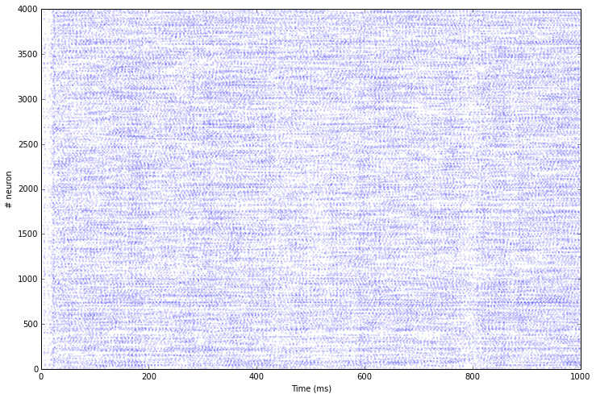

***********************
COBA and CUBA networks
***********************

The scripts ``COBA.py`` and ``CUBA.py`` in ``examples/vogels_abbott``
reproduce the two first benchmarks used in:

**Brette, R., Rudolph, M., Carnevale, T., Hines, M., Beeman, D., Bower,
J. M., et al.** (2007), Simulation of networks of spiking neurons: a
review of tools and strategies., *J. Comput. Neurosci., 23, 3, 349–98*

Both are based on the balanced network proposed by:

**Vogels, T. P. and Abbott, L. F.** (2005), Signal propagation and logic
gating in networks of integrate-and-fire neurons., *J. Neurosci., 25,
46, 10786–95*

The network is composed of 4000 neurons (3200 excitatory and 800
inhibitory), reciprocally connected with a probability of 0.02 (sparse
connection).

The CUBA network uses a current-based integrate-and-fire neuron model:

.. math:: \tau \cdot \frac{dv (t)}{dt} = E_l - v(t) + g_\text{exc} (t) - g_\text{inh} (t)

while the COBA model uses conductance-based IF neurons:

.. math:: \tau \cdot \frac{dv (t)}{dt} = E_l - v(t) + g_\text{exc} (t) * (E_\text{exc}) - v(t)) + g_\text{inh} (t) * (E_\text{inh}) - v(t)) + I(t)

Apart from the neuron model and synaptic weights, both networks are
equal, so we'll focus on the COBA network here.

The discretization step has to be set to 0.1 ms:

.. code:: python

    from ANNarchy import * 
    setup(dt=0.1) 

Neuron definition
-----------------

.. code:: python

    COBA = Neuron(
        parameters="""
            El = -60.0          : population
            Vr = -60.0          : population
            Erev_exc = 0.0      : population
            Erev_inh = -80.0    : population
            Vt = -50.0          : population
            tau = 20.0          : population
            tau_exc = 5.0       : population
            tau_inh = 10.0      : population
            I = 20.0            : population
        """,
        equations="""
            tau * dv/dt = (El - v) + g_exc * (Erev_exc - v) + g_inh * (Erev_inh - v ) + I
    
            tau_exc * dg_exc/dt = - g_exc
            tau_inh * dg_inh/dt = - g_inh
        """,
        spike = "v > Vt",
        reset = "v = Vr",
        refractory = 5.0
    )

.. code:: python

    CUBA = Neuron(
        parameters="""
            El = -49.0      : population
            Vr = -60.0      : population
            Vt = -50.0      : population
            tau_m = 20.0    : population
            tau_exc = 5.0   : population
            tau_inh = 10.0  : population
        """,
        equations="""
            tau_m * dv/dt = (El - v) + g_exc + g_inh 
    
            tau_exc * dg_exc/dt = - g_exc 
            tau_inh * dg_inh/dt = - g_inh 
        """,
        spike = "v > Vt",
        reset = "v = Vr",
        refractory = 5.0
    )

The neurons define exponentially-decreasing conductance g\_exc and
g\_inh for the excitatory and inhibitory conductances/currents,
respectively.

They also define a refractory period of 5 ms.

Population
----------

.. code:: python

    P = Population(geometry=4000, neuron=COBA)
    Pe = P[:3200]
    Pi = P[3200:]

We create a population of 4000 COBA neurons, and assign the 3200 first
ones to the excitatory population and the 800 last ones to the
inhibitory population.

It would have been equivalent to declare two separate populations as:

.. code:: python

    Pe = Population(geometry=3200, neuron=COBA)
    Pi = Population(geometry= 800, neuron=COBA)

but splitting a global population allows to apply methods to all
neurons, for example when recording all spikes with a single monitor, or
when initializing populations parameters uniformly:

.. code:: python

    P.v = Normal(-55.0, 5.0)
    P.g_exc = Normal(4.0, 1.5)
    P.g_inh = Normal(20.0, 12.0)

Connections
-----------

The neurons are randomly connected with a probability of 0.02.
Excitatory neurons project on all other neurons with the target "exc"
and a weight of 0.6, while the inhibitory neurons have the target "inh"
and a weight of 6.7.

.. code:: python

    Ce = Projection(pre=Pe, post=P, target='exc')
    Ce.connect_fixed_probability(weights=0.6, probability=0.02)
    
    Ci = Projection(pre=Pi, post=P, target='inh')
    Ci.connect_fixed_probability(weights=6.7, probability=0.02)

.. code:: python

    compile()

Simulation
----------

We first define a monitor to record the spikes emitted in the whole
population:

.. code:: python

    m = Monitor(P, ['spike'])

We can then simulate for 1 second:

.. code:: python

    simulate(1000.)

We retrieve the recorded spikes from the monitor:

.. code:: python

    data = m.get('spike')

and compute a raster plot from the data:

.. code:: python

    t, n = m.raster_plot(data)

``t`` and ``n`` are lists representing for each spike emitted during the
simulation the time at which it was emitted and the index the neuron
which fired. The length of this list represents the total number of
spikes in the popultion, so we can compute the population mean firing
rate:

.. code:: python

    print('Mean firing rate in the population: ' + str(len(t) / 4000.) + 'Hz')

.. parsed-literal::

    Mean firing rate in the population: 19.523Hz

Finally, we can show the raster plot with pylab:

.. code:: python

    from pylab import *
    plot(t, n, '.', markersize=0.5)
    xlabel('Time (ms)')
    ylabel('# neuron')
    show()

